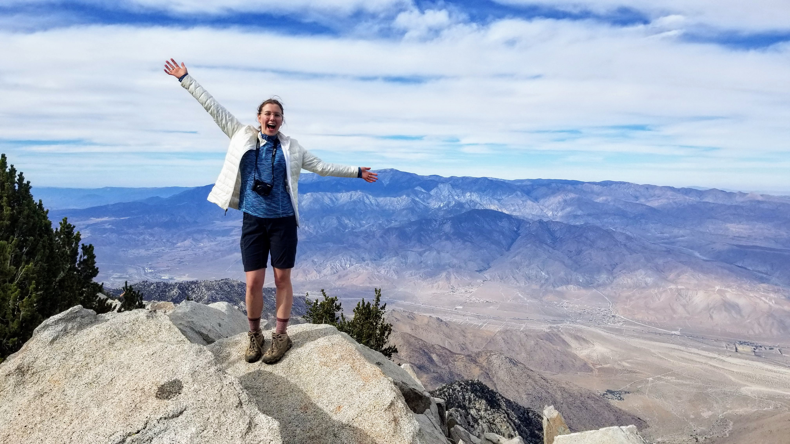

\

**Favorite ecosystems**: arid deserts, ponderosa pine woodlands, kelp forests, tropical wet forest, redwood forests
\
**Favorite critters**: Fringe-toed lizards, indoor cats, leeches

I'm a evolutionary geneticist working to apply genomics and population genetic theory to conservation and management questions. I'm interested in how patterns of population structure change over time and space, and in figuring out the best ways to detect and validate those patterns.

Though I am originally from the San Francisco Bay Area, I have had the pleasure of living and doing science with amazing people in 7+ states/countries. 


```{r, echo=F, out.width= "40%", out.extra='style="float:left; padding:10px"', fig.alt = "woman standing at vista point, smiling, in front of a crater lake"}
knitr::include_graphics("./images/meaghan2.jpg")
```

```{r, echo=F, out.width= "40%", out.extra='style="float:left; padding:10px"', fig.alt = "woman standing at vista point overlooking a dry valley, with snow-capped mountains in the distance"}

```

```{r, echo=F, out.width= "40%", out.extra='style="float:left; padding:10px"', fig.alt = "A blandings turtle sticking its head out of a duck-weed covered pond"}
knitr::include_graphics("./images/blandings.jpg")
```
