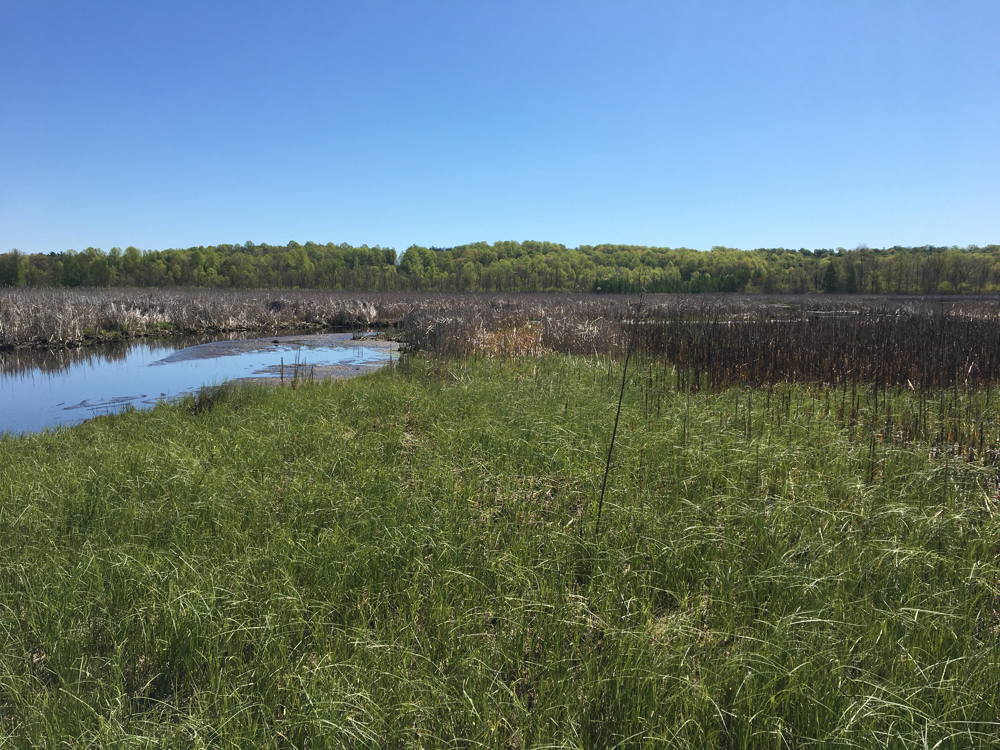

  
  
### Welcome

Hello! I am currently a PhD candidate at Michigan State University working with Drs. [Gideon Bradburd](http://www.genescape.org/)
 and [Sarah Fitzpatrick](http://swfitz.com/). I am part of the Department of Integrative Biology, the Ecology, Evolution, and Behavior Program, and Kellogg Biological Station. I received my master's with [Dr. Jeanne Robertson](https://jrobertsonlab.wordpress.com/) at California State University Northridge. I study small populations, and how they have persisted in the face of anthropogenic changes. 


```{r, out.width = "500px", echo=F, fig.align='center', fig.alt = "grassy wetlands adjacent to a slow-moving river in early Michigan summer"}

```

```{r, out.width = "500px", echo=F, fig.align='center', fig.alt = "woman standing in the desert, smiling, wearing a wide-brimmed hat"}
knitr::include_graphics("./images/lizards.jpg")
```

